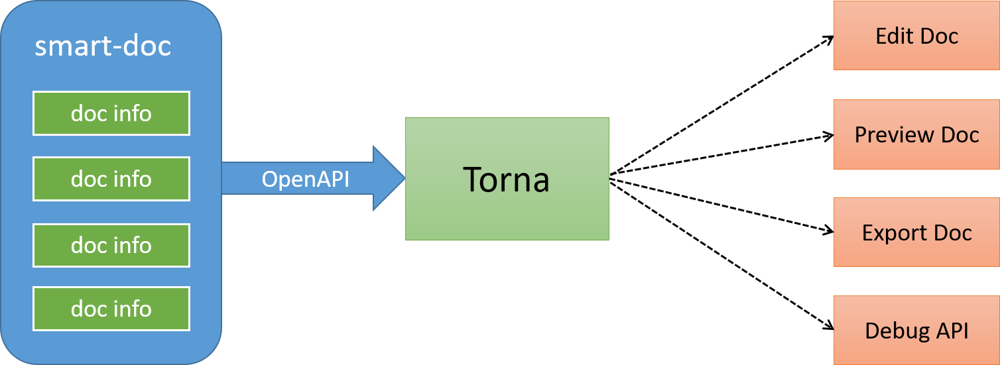

# ll-plugin-doc-generate

<h1 align="center">base on smart-doc project</h1>

[](https://www.apache.org/licenses/LICENSE-2.0)


## Introduce

doc-generate is a tool that supports both JAVA REST API and Apache Dubbo RPC interface document generation. doc generate is
based on interface source code analysis to generate interface documents, and zero annotation intrusion. You only need to
write Javadoc comments when developing, doc-generate can help you generate Markdown or HTML5 document. doc-generate does not
need to inject annotations into the code like Swagger.

## Features

- Zero annotation, zero learning cost, only need to write standard JAVA document comments.
- Automatic derivation based on source code interface definition, powerful return structure derivation support.
- Support Spring MVC, Spring Boot, Spring Boot Web Flux (Not support endpoint), Feign.
- Supports the derivation of asynchronous interface returns such as Callable, Future, CompletableFuture.
- Support JSR-303 parameter verification specification.
- Support for automatic generation of request examples based on request parameters.
- Support for generating JSON return value examples.
- Support for loading source code from outside the project to generate field comments (including the sources jar
  package).
- Support for generating multiple formats of documents: Markdown,HTML5,Asciidoctor,Postman Collection 2.0+,OpenAPI 3.0.
- Support for exporting error codes and data dictionary codes to API documentation.
- The debug html5 page fully supports file upload and download testing.
- Support Apache Dubbo RPC.

## Best Practice

doc-generate + [Torna](http://torna.cn) form an industry-leading document generation and management solution, using
doc-generate to complete Java source code analysis and extract annotations to generate API documents without intrusion, and
automatically push the documents to the Torna enterprise-level interface document management platform.



## Building

You could build with the following commands. (Java 1.8 is required to build the master branch)

```
mvn clean install -Dmaven.test.skip=true
```

## TODO

- Jakarta RS-API 2.x

## License

doc-generate is under the Apache 2.0 license. See
the [LICENSE](LICENSE) file for details.


### 生成及使用
```
//生成html
mvn -Dfile.encoding=UTF-8 doc-generate:html
//生成markdown
mvn -Dfile.encoding=UTF-8 doc-generate:markdown
//生成adoc
mvn -Dfile.encoding=UTF-8 doc-generate:adoc
//生成postman json数据
mvn -Dfile.encoding=UTF-8 doc-generate:postman
// 生成 Open Api 3.0+,Since doc-generate-maven-plugin 1.1.5
mvn -Dfile.encoding=UTF-8 doc-generate:openapi
// 生成文档推送到Torna平台
mvn -Dfile.encoding=UTF-8 doc-generate:torna-rest

// Apache Dubbo RPC文档
// Generate html
mvn -Dfile.encoding=UTF-8 doc-generate:rpc-html
// Generate markdown
mvn -Dfile.encoding=UTF-8 doc-generate:rpc-markdown
// Generate adoc
mvn -Dfile.encoding=UTF-8 doc-generate:rpc-adoc

// 生成dubbo接口文档推送到torna
mvn -Dfile.encoding=UTF-8 doc-generate:torna-rpc
```
