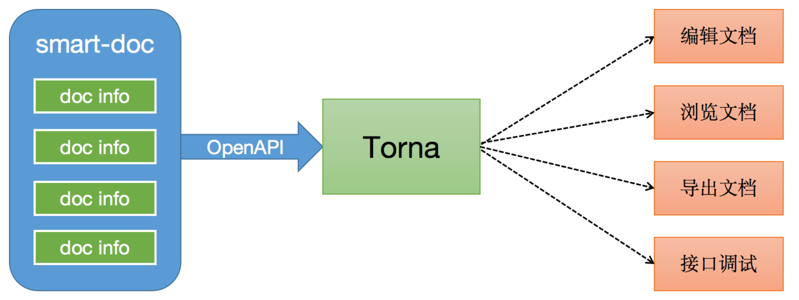

# java-plugin-doc-generate

<h1 align="center">基于smart-doc开源项目</h1>

[](https://www.apache.org/licenses/LICENSE-2.0)


## Introduce

doc-generate是一款同时支持JAVA REST API和Apache Dubbo RPC接口文档生成的工具，doc-generate在业内率先提出基于JAVA泛型定义推导的理念，
完全基于接口源码来分析生成接口文档，不采用任何注解侵入到业务代码中。你只需要按照java-doc标准编写注释， doc-generate就能帮你生成一个简易明了的Markdown、HTML5、Postman
Collection2.0+、OpenAPI 3.0+的文档。

> 无论你是很有经验的大佬、还是刚入行的萌新。遇到使用疑惑时，我们希望你能仔细阅读doc-generate官方码云的wiki文档。我们将doc-generate及其插件的 每一个配置项和可能在日常中遇到的问题都整理到了文档中。仔细阅读文档就是对开源项目最大的支持。

## Features

- 零注解、零学习成本、只需要写标准JAVA注释。
- 基于源代码接口定义自动推导，强大的返回结构推导。
- 支持Spring MVC、Spring Boot、Spring Boot Web Flux(controller书写方式)、Feign。
- 支持Callable、Future、CompletableFuture等异步接口返回的推导。
- 支持JavaBean上的JSR303参数校验规范，包括分组验证。
- 对JSON请求参数的接口能够自动生成模拟JSON参数。
- 对一些常用字段定义能够生成有效的模拟值。
- 支持生成JSON返回值示例。
- 支持从项目外部加载源代码来生成字段注释(包括标准规范发布的jar包)。
- 支持生成多种格式文档：Markdown、HTML5、Asciidoctor、Postman Collection、OpenAPI 3.0。 Up- 开放文档数据，可自由实现接入文档管理系统。
- 支持导出错误码和定义在代码中的各种字典码到接口文档。
- 支持Maven、Gradle插件式轻松集成。
- 支持Apache Dubbo RPC接口文档生成。
- debug接口调试html5页面完全支持文件上传，下载(@download tag标记下载方法)测试。

## Best Practice

doc-generate + [Torna](http://torna.cn) 组成行业领先的文档生成和管理解决方案，使用doc-generate无侵入完成Java源代码分析和提取注释生成API文档，自动将文档推送到Torna企业级接口文档管理平台。



[doc-generate+Torna文档自动化]

> Torna是由doc-generate官方独家推动联合研发的企业级文档管理系统，因此doc-generate官方不会对接其它任何的外部文档管理系统，例如像showdoc、yapi 之类的对接请自定内部处理，也不要再给我们提其他文档系统对接的PR。我们核心是把doc-generate+Torna的这套方案打造好。

## Building

如果你需要自己构建doc-generate，那可以使用下面命令，构建需要依赖Java 1.8。

```
mvn clean install -Dmaven.test.skip=true
```

## TODO

- Jakarta RS-API 2.x

## License

doc-generate is under the Apache 2.0 license. See
the [LICENSE](LICENSE) file for details.


### 生成及使用
```
//生成html
mvn -Dfile.encoding=UTF-8 doc-generate:html
//生成markdown
mvn -Dfile.encoding=UTF-8 doc-generate:markdown
//生成adoc
mvn -Dfile.encoding=UTF-8 doc-generate:adoc
//生成postman json数据
mvn -Dfile.encoding=UTF-8 doc-generate:postman
// 生成 Open Api 3.0+,Since doc-generate-maven-plugin 1.1.5
mvn -Dfile.encoding=UTF-8 doc-generate:openapi
// 生成文档推送到Torna平台
mvn -Dfile.encoding=UTF-8 doc-generate:torna-rest

// Apache Dubbo RPC文档
// Generate html
mvn -Dfile.encoding=UTF-8 doc-generate:rpc-html
// Generate markdown
mvn -Dfile.encoding=UTF-8 doc-generate:rpc-markdown
// Generate adoc
mvn -Dfile.encoding=UTF-8 doc-generate:rpc-adoc

// 生成dubbo接口文档推送到torna
mvn -Dfile.encoding=UTF-8 doc-generate:torna-rpc
```
